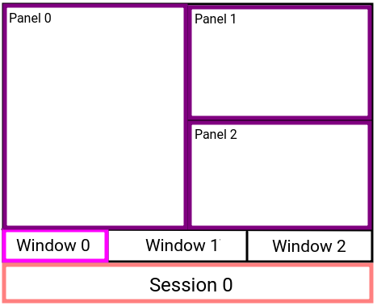

## Tmux cheat sheet

### SHORT DESCRIPTION 
Tmux is a terminal multiplexer: it enables a number of terminals to be created, accessed, and controlled from a single screen.
The main parts of Tmux are: _sessions_, _windows_ and _panels_.
In each session you can create multiple windows that can contain multiple panel. In the following figure a representation of a tmux session with 3 windows, and in which the first window has 3 panels.


---

### SESSION 
#### Main commands
|                COMANND                |                DESCRIPTION               |
|:-------------------------------------:|:----------------------------------------:|
|    ```tmux new -s <session-name>```   | Create new session called <session-name> |
| ```tmux kill-ses -t <session-name>``` |    Kill session called <session-name>   |
|             ```tmux ls```             |             Show all sessions            |
|             ``` tmux a```             |          Attach to last session          |
|    ``` tmux a -t <session-name> ```   |     Attach to session <session-name>     |
  
#### Shortcuts
|        SHORTCUT        |         DESCRIPTION         |
|:----------------------:|:---------------------------:|
|  ``` Ctrl+b``` ```$``` |        Rename session       |
|  ``` Ctrl+b``` ```d``` | Detach from current session |
| ``` Ctrl+b ``` ```(``` |   Move to previous session  |
| ``` Ctrl+b ``` ```)``` |     Move to next session    |
|                        |                             |

---

### WINDOW 
|               SHORTCUT               |            DESCRIPTION           |
|:------------------------------------:|:--------------------------------:|
|       ``` Ctrl+b ``` ``` c ```       |         Create new window        |
|       ``` Ctrl+b ``` ``` , ```       |       Rename current window      |
|       ``` Ctrl+b ``` ``` & ```       |       Close current window       |
|         ``` Ctrl+b``` ```p```        |    Switch to previuous window    |
|         ``` Ctrl+b``` ```n```        |       Switch to next window      |
| ``` Ctrl+b ``` ```<window-number>``` | Switch to window <window-number> |
---

### PANEL 
|                   SHORTCUT                  |                DESCRIPTION               |
|:-------------------------------------------:|:----------------------------------------:|
|           ``` Ctrl+b ``` ``` % ```          |            Split horizontally            |
|            ``` Ctrl+b``` ```"```            |             Split vertically             |
| ``` Ctrl+b ``` ```Spacebar ```              | Rearrange panels                         |
| ``` Ctrl+b ``` ```x```                      | Close current panel                      |
|            ``` Ctrl+b``` ```{```            |        Move current panel left/up        |
|            ``` Ctrl+b ``` ```}```           |      Move current panel right/bottom     |
|        ``` Ctrl+b ``` ```[←,↑,→,↓]```       | Switch to panel indicated from the arrow |
| ``` Ctrl+b ``` ```q```                      | Show panel number                        |
| ``` Ctrl+b ``` ```q``` ```<panel-number>``` | Switch to panel number <panel-number>    |
| ``` Ctrl+b+[→,←]```                         | Increase/Reduce panel size horizontally  |
| ``` Ctrl+b+[↑,↓]```                         | Increase/Reduce panel size vertically    |

---
